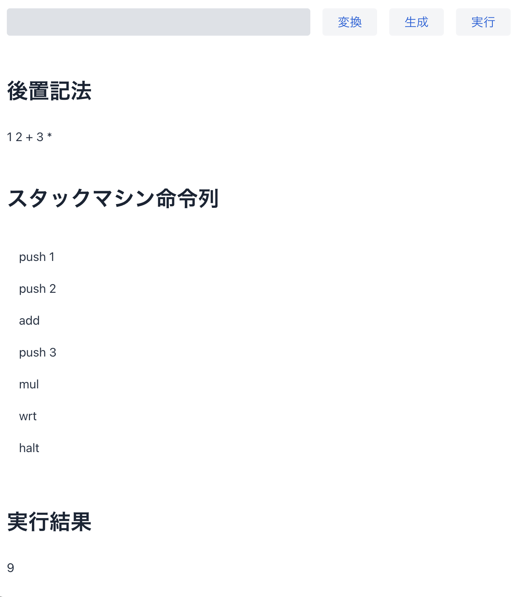

# プログラミング演習II テーマ4 (2021年12月21日)

1. テーマ3で作成した四則演算を計算する仮想計算機のインタフェースをGUI化する。
2. ステップ1では簡単なGUIを作成する。

## ステップ1

テーマ3の処理の流れは以下の通りである。
1. 中置記法の式をキーボードから入力する
1. 入力された式を二分木へ変換する
1. 二分木から後置記法の式へ変換する
1. 後置記法の式からスタックマシンの命令列を生成する
1. スタックマシンによって生成された命令列を計算すし、wrt命令によりスタックの値をpopして標準出力に表示する

テーマ4ではこれを以下のように変更する。
1. 中置記法の式を**テキストフィールド**から入力する
1. **変換ボタンを押す**と入力された式を二分木へ変換する
1. 二分木から後置記法の式へ変換し**画面に表示する**
1. **生成ボタンを押す**と後置記法の式からスタックマシンの命令列を生成するし画面に表示する
1. **実行ボタンを押す**とスタックマシンによって生成された命令列を計算し、wrt命令によりスタックの値をpopして画面に表示する

# プロジェクトの構成

* calcvm.CalcVMView クラス (src/main/java/calcvm以下) 
  * サンプルコードのクラス

# 実行方法

The project is a standard Maven project. To run it from the command line,
type `mvnw` (Windows), or `./mvnw` (Mac & Linux), then open
http://localhost:8080 in your browser.

You can also import the project to your IDE of choice as you would with any
Maven project. Read more on [how to import Vaadin projects to different 
IDEs](https://vaadin.com/docs/latest/flow/guide/step-by-step/importing) (Eclipse, IntelliJ IDEA, NetBeans, and VS Code).

# Useful links

- Read the documentation at [vaadin.com/docs](https://vaadin.com/docs).
- Follow the tutorials at [vaadin.com/tutorials](https://vaadin.com/tutorials).
- Watch training videos and get certified at [vaadin.com/learn/training](https://vaadin.com/learn/training).
- Create new projects at [start.vaadin.com](https://start.vaadin.com/).
- Search UI components and their usage examples at [vaadin.com/components](https://vaadin.com/components).
- Discover Vaadin's set of CSS utility classes that enable building any UI without custom CSS in the [docs](https://vaadin.com/docs/latest/ds/foundation/utility-classes). 
- Find a collection of solutions to common use cases in [Vaadin Cookbook](https://cookbook.vaadin.com/).
- Find Add-ons at [vaadin.com/directory](https://vaadin.com/directory).
- Ask questions on [Stack Overflow](https://stackoverflow.com/questions/tagged/vaadin) or join our [Discord channel](https://discord.gg/MYFq5RTbBn).
- Report issues, create pull requests in [GitHub](https://github.com/vaadin/platform).
